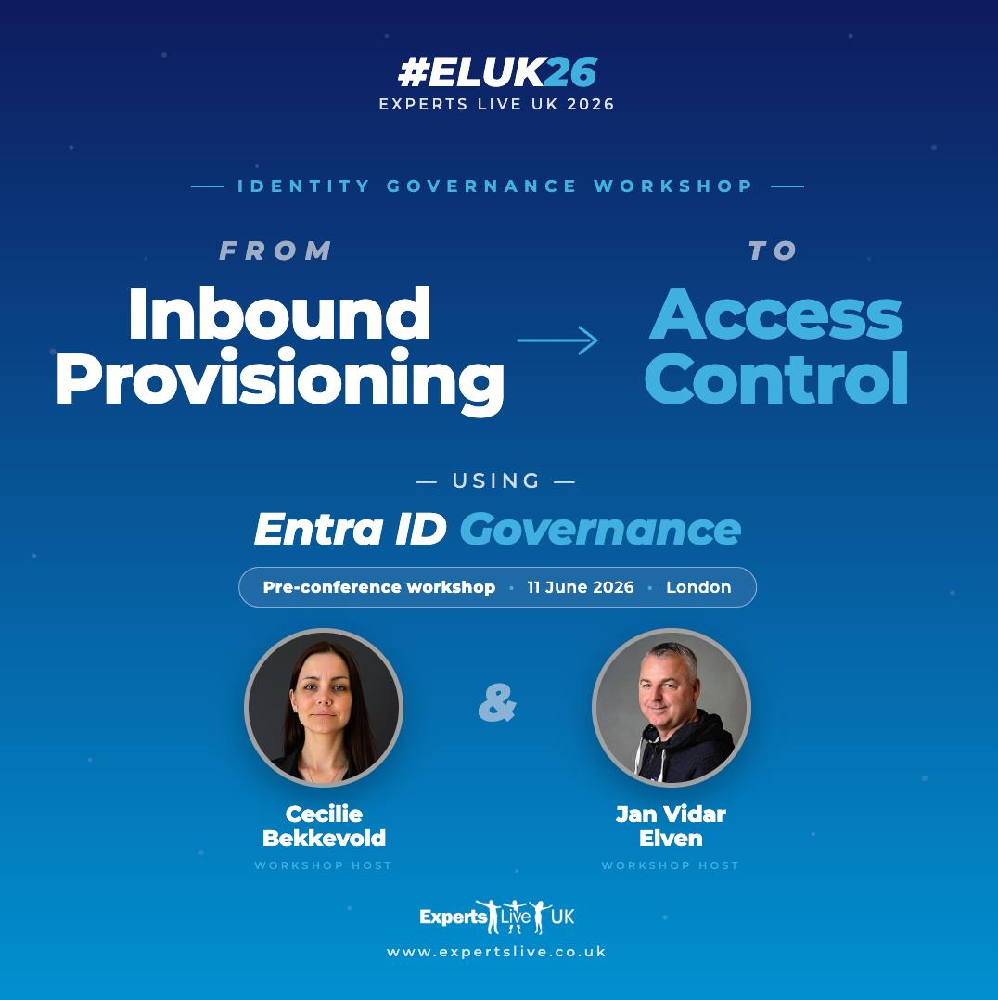

# Lab & Resource Source for Identity Governance Master Class - Experts Live UK 2026

This repository contains labs and resources for attendees at Identity Governance Masterclass Workshop, Experts Live UK 2026.

## Agenda

Look at the [Agenda](Agenda.md) for details on timings for the Identity Governance Masterclass Workshop at Experts Live UK 2026.

## Labs

Check the [Lab Instructions](labs/Readme.md) to prepare for the Identity Governance Master Class at Experts Live UK 2026.

- [Lab 1 - Inbound Provisioning API and Lifecycle Workflows](labs/lab-1-inbound-provisioning-lcw/lab-1-inbound-provisioning-lcw.md)
- [Lab 2 - Privileged Users & Identity Stores with SCIM](labs/lab-2-privileged-users-identity-stores-scim/lab-2-privileged-users-identity-stores-scim.md)
- [Lab 3 - Access Catalog & Package Management - Policies - Custom Extensions](labs/lab-3-elm-ce/lab-3-elm-ce.md)
- [Lab 4 - Agent ID Lifecycle & Access Management](labs/lab-4-agent-id-lifecycle-access/lab-4-agent-id-lifecycle-access.md)

## Resources

Further resources are available in the [resources](resources) folder:

- [Azure Lighthouse](resources/resource-1-azure-lighthouse)
- [SCIM Sample Payloads](resources/resource-2-scim-sample-payloads)
- [Bicep Custom Extensions](resources/resource-3-bicep-custom-extensions)

## Contributing and Code of Conduct

Please read our [Contributing Guide](Contribute.md) and [Code of Conduct](Code-of-Conduct.md) for details on on contribution and the process for submitting pull requests to us.
